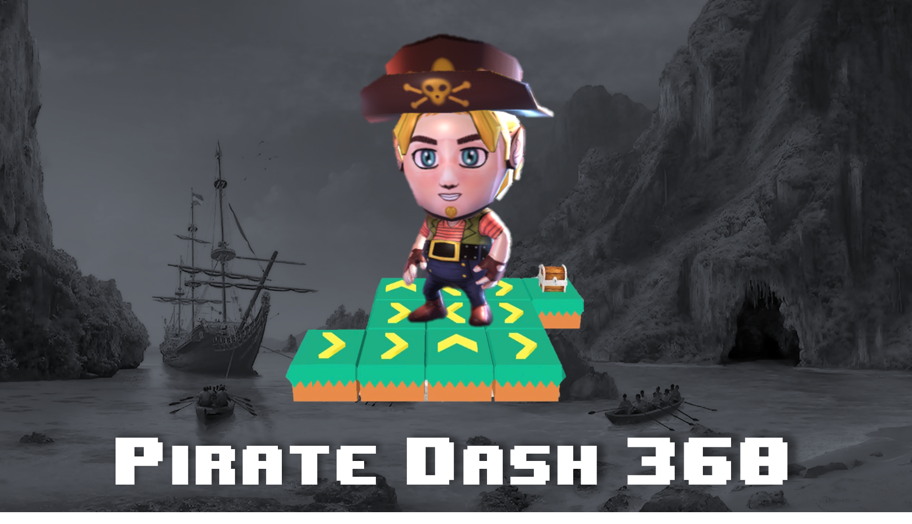

# Pirate Dash 360
## Guide the pirate to the treasure! A 360° AR puzzle platformer game that hones logical thinking, memory and problem solving skills. Choose from 3 worlds of varying themes, obstacles and challenges!

<i>Submission for Facebook Hackathon: AR</i>

Team Members: <a href="https://github.com/gabrielkzm">Gabriel Koh</a>, <a href="https://github.com/ngrq123">Ng Rui Qin</a>, <a href="https://github.com/yankai364">Ong Yan Kai</a>, <a href="https://github.com/vncnttkkk">Vincent Tok</a>

## Getting Started

### Instagram
*To be updated after publishing effect*

### Spark AR Studio

#### 1. Clone repository
~~~
git clone git@github.com:yankai364/Pirate-Dash-360.git
~~~
#### 2. Open the project file in Spark AR Studio
#### 3. Commence game either through emulator, or connect via phone

## Inspiration

As recent university graduates, each of us are about to step into the working world. Looking back on our educational journey, we thought of instances that have propelled us into the world of technology, and some highlights include playing puzzle games like Rush Hour, Circuit Maze and Carcassonne. These brain stimulating games have indeed formed the foundation of our technology backgrounds, as they strengthened our **logical thinking aptitude, planning, memory capacity and problem solving skills**.

As a team, we wanted to **pay it forward and contribute to society**, especially in the **education space**. We wanted to do so through a fun and fuss-free medium. After all,  learning is most productive when it is fun! To maximize the fun, we wanted to incorporate elements of **cutting edge technology** in today's society for a stronger user engagement and experience. During this difficult period, as people around the world are staying home and observing social distancing measures due to COVID-19, we have come to realize that some parents are finding it difficult to keep their children occupied productively. To tackle this, we decided to design a solution to keep youths engaged while developing their logical reasoning and problem solving skills. After several rounds of ideation, **Pirate Dash 360** was born.

## What it does

**Pirate Dash 360** provides an immersive **360° Augmented Reality (AR) puzzle experience** through a platformer game which brings the player into the world of treasure hunting by solving puzzles. Players are tasked to formulate a path which leads the pirate from the start tile to the end tile (where the treasure chest is located) while avoiding various traps and obstacles. This is done via swapping of directional tiles. Through this game, we hope to strengthen the player's logical thinking, as they have to derive an answer from randomized tile patterns.

Currently, **Pirate Dash 360** offers a selection of 3 different worlds (Grass, Snow and Desert) of varying difficulty, each comprising 5 separate levels. Each level features traps, obstacles, tile variations and many more!

*From left to right: Grass World Level 1, Snow World Level 1, Desert World Level 1, Snow World top view*

## How we built it
Each world was designed with a theme and different set of challenges in mind. To project a fun and unified experience, we carefully curated a range of assets such as 3D objects, images and sounds from multiple sources. We then positioned and scaled the assets in Spark AR Studio. We also made use of Spark AR's native picker as a user interface, as well as particle systems to enhance the environment.

To ensure that the tiles are placed precisely, we rendered them programmatically through a script, where all of the game logic is written. Our animations and interactions with materials/textures were also achieved with scripting, using the Spark AR Studio API. We also used the Patch Editor in Spark AR Studio to bridge our script and pass variables into the program to manipulate animation controllers of our objects. 

## Challenges we ran into
As most of us were new to augmented reality and game programming, we had to learn Spark AR from scratch. Fortunately, the tutorials were informative and provided us with what we needed to complete our game. Some of our main challenges include the following:

- Sourcing and curation of assets that were within our stipulated budget, whilst maintaining the 4 MB size requirement for deployment of **Pirate Dash 360** on Instagram.

- Our lack of knowledge on 3D modelling and animation concepts such as blending, cull and animation curves made it difficult for us to configure the aesthetics of our game in the earlier weeks. Despite multiple attempts, we were not able to do due to time constraint and bandwidth limitations. We decided to utilize the wealth of resources available from third parties such as SketchFab.

- While we used scripting to create most of our animations, we were not able to change the animation controller attached to our 3D objects without the Patch Editor. We managed to integrate the script and Patch Editor via passing of variables, but the Option Picker was limited to only 5 options, and hence, we could not fully utilize the range of animations of our objects.

- We had multiple ambitious ideas around the usage of AR during our planning stage, but many proved infeasible due to the size limit. However, this is fully understandable and we are glad to have overcame this challenge towards the end.

- Some of us concurred on the initial learning curve of the patch editor for animation tweaks. This was resolved over time through practice, and we realized the immense equity that it provides for developers.

- We had issues with positioning and piecing together assets in the World View, as we were pretty new to AR technology. This got better over time, through practice and playing around with the different tooling available in Spark AR Studio.
  

## Accomplishments that we’re proud of
Overall, we are delighted with our end product, and only wished we had time to implement more fascinating features we had in mind. That being said, we are really proud of what we have achieved as a team. We started out with a single level, moved on to create 5 levels, and ended up with 3 worlds of 5 levels each. It has been an incredible journey and we are glad to created a fully functional AR game.

## What we learned
We learnt so much regarding Spark AR Studio and how scripting can be used to enhance the overall AR experience. Through our various brainstorming and ideation sessions, we learnt that that there are endless possibilities when it comes to AR, and can be leveraged in many settings including, but not limited to, education and gaming. Some key learning points include:

- Learnt about how animations work and how they can be created in Spark AR with the Patch Editor.

- Learnt how to create Spark AR projects and script using JavaScript with reactive programming.

- Learnt about UI/UX, theming and A/B Testing, through this, we were able to piece together various curated UI assets, which helped us in conceptualizing and theming of the game, thus, providing a natural and intuitive experience for our gamers.

- Learnt about the benefits of AR and Education-based Gaming, and how we could potentially bring across social good and value to the masses through cutting edge technology.
  

## What's next for Pirate Dash 360
We have great plans for **Pirate Dash 360**! We intend to add more world themes and levels, include new obstacles and more complexities into the game. Beyond this, we also plan to introduce elements that will further challenge short-term memory capacity as well as visual and spatial reasoning. Examples include jigsaw puzzles, rotating tiles and an eight directional tile system as compared to our current four directional tile system. Look forward to our updates!

## Acknowledgements

- SketchFab
- Quaternius.Itch.IO
- Kenney
- Facebook Sound Design
- Global Genius
- Spark AR Studio

### 3D Assets
https://www.kenney.nl/assets/platformer-kit  
https://www.kenney.nl/assets/pirate-kit  
https://sketchfab.com/3d-models/3d-sidescroller-little-pirate-7329a3297b374a8ca0bbb032eb49a3aa    
https://sketchfab.com/3d-models/treasure-chest-b46fd9edd44e412fa76f9b9a2b86281c  
https://sketchfab.com/3d-models/chevron-f4a277b8d9cd47e0bea272eb58c1c5b0  
https://sketchfab.com/3d-models/bomberman-bomb-4a109903cbd34bef9d48e427a2d4da78  
https://sketchfab.com/3d-models/bomberman-fire-8e482145eeed419980fabf073fcb13c9  
https://quaternius.itch.io/platformer-pack/  

### Audio Assets

Imported from within Spark AR Studio.

Sources: 
- Facebook Sound Design
- Global Genius

---
*Updated as at 24 June 2020*
