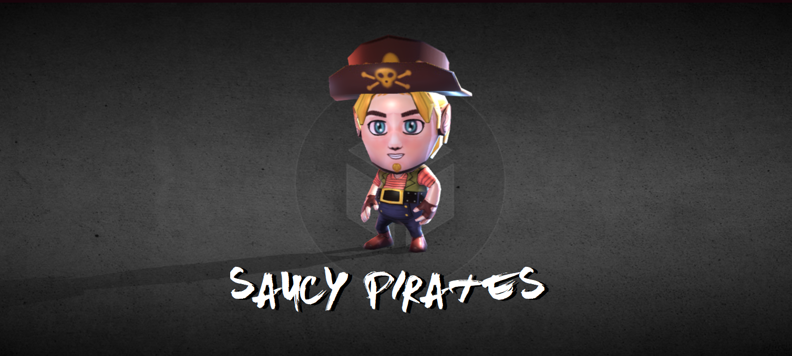
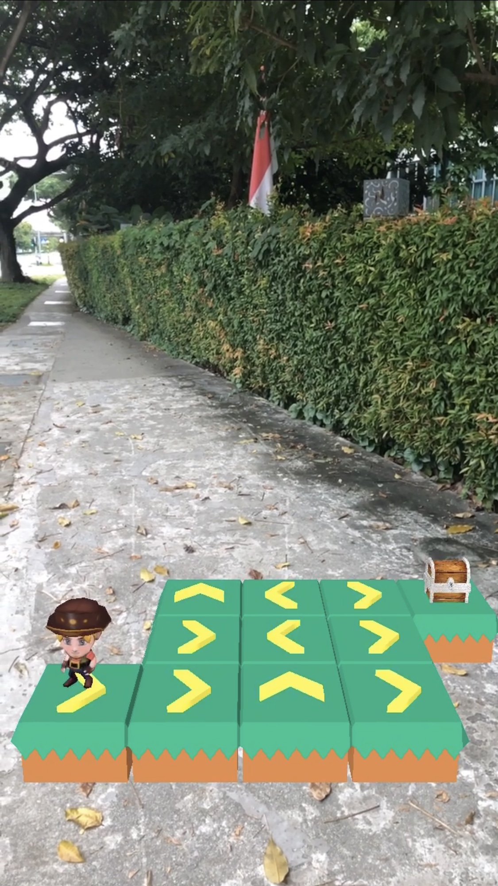

# Saucy Pirates, a Pirate-themed AR Puzzle Game
*by Team CharizARds for Facebook Spark AR Hackathon*

## Getting Started
Try out our game here (You will need to log onto your Instagram account):  
https://www.instagram.com/ar/3521555794541192/?ch=YTI2MDBkODQ5YzY2NjZlNDQ3OWM0MDNkODg3ZTQ3NjM%3D

---
## Inspiration
Before we started on computer games, we played physical puzzle games like Rush Hour and Circuit Maze when we were young. They were brain stimulating games that helped to strengthen our logical thinking, planning and problem solving skills. At the same time, in this COVID-19 period of staying home, parents are finding it hard to keep their children occupied. Therefore, we hope to recreate this puzzle experience for our future generation with an Augmented Reality (AR) platform game that we have conceived through several rounds of ideation, which we hope will occupy their time not just during this stay-home period, but beyond as well.

---
## What it does
Players are supposed to move the pirate from the start to the end, where the treasure chest is located. They have to swap the directional tiles in order to complete each puzzle. Through this game, we hope to strengthen the player's logical thinking, as there are multiple ways that the user can formulate the answer to the puzzle.

---
## How we built it
The game was built entirely using the Spark AR Studio. The main scripting done was JavaScript, and this set of code executes a set of commands based on the user’s swaps, and also allows them to toggle between different levels. Various game objects were sourced from different sites that provided game assets for free.

We have created a few levels for our players, and they come in a 3 x 3 and a 4 x 4 grid. Players are required to swap the tiles to complete the game successfully. Currently, these are the levels and puzzle types available:  

---
## Challenges we ran into
As we were new to the realms of augmented reality, we had to learn Spark AR from scratch. Fortunately, the tutorials were informative and provided us with what we needed to complete our game. 

We also faced issues with sourcing and coming up with the assets as we are not trained in the field of graphic design. Nonetheless, we were able to find the assets that suited this game.

---
## Accomplishments that we’re proud of
We were very satisfied with the end result, as we were total AR novices at the very beginning. We came up with a lot of ideas, including an interactive ocean, and eventually settled for this puzzle game after considering the various limitations that we encountered.

---
## What we learned
We learnt so much regarding Spark AR Studio and how scripting can be used to enhance the AR experience. From coming up with ideas and designing the gameplay, we have learnt that that there are endless possibilities that AR can be used to enhance an experience. Although we were only doing it for a mobile device, it 

---
## What's next for Saucy Pirates
Next, we plan to add in more tile types, such as distractors, and allow for different difficulty levels in the different grids.

---
## Acknowledgements/Resources/References
SketchFab  
Kenney  
Javascript  
Spark-AR  

### Links
https://www.kenney.nl/assets/platformer-kit  
https://sketchfab.com/3d-models/3d-sidescroller-little-pirate-7329a3297b374a8ca0bbb032eb49a3aa  
https://sketchfab.com/3d-models/treasure-chest-b46fd9edd44e412fa76f9b9a2b86281c  
https://sketchfab.com/3d-models/chevron-f4a277b8d9cd47e0bea272eb58c1c5b0  

---
*Updated as at 12 June 2020*
